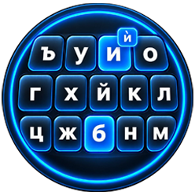
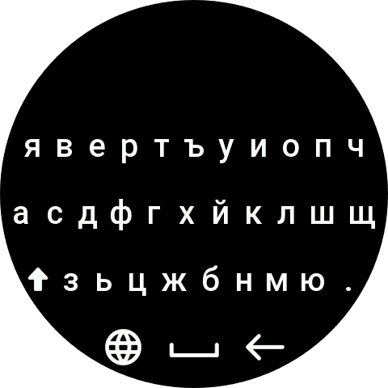
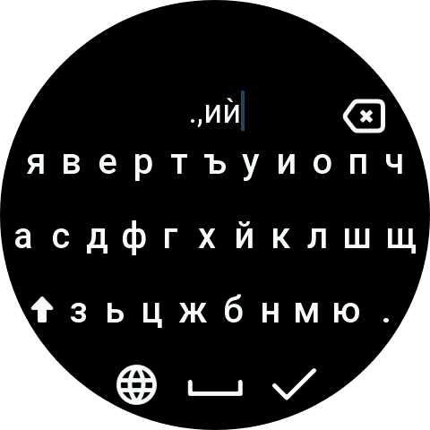
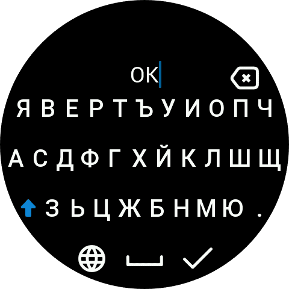
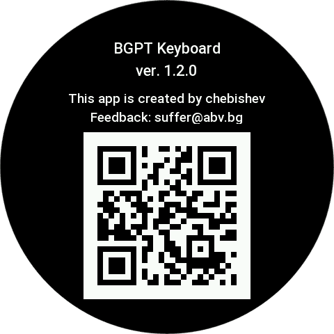

# BGPT Keyboard

Bulgarian Phonetic Traditional keyboard for Zepp OS.

BGPT Keyboard provides a Bulgarian phonetic traditionalkeyboard for compatible
Zepp OS devices.

## Features

- Bulgarian phonetic traditional keyboard layout
- Lowercase and uppercase input
- Long press `и` for `ѝ`
- Long press `.` for `,`
- Integration with the Zepp OS input method system

## Compatibility

- Zepp OS API Level 4.2+
- Square and Round devices support

## Credits

Based on the official Zepp OS Simple Keyboard sample:
https://github.com/zepp-health/zeppos-samples/tree/main/application/4.2/simple-keyboard

## Screenshots

## License
Zepp OS samples are provided by Zepp Health under the Apache License 2.0.